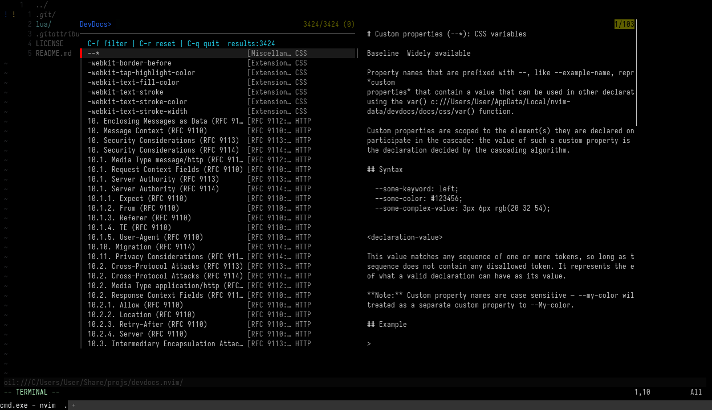

<div align="center">
  
</div>

# devdocs.nvim

Read [DevDocs](https://devdocs.io) documentation inside Neovim.

Authors: DeepSeek-V4-Flash🧙‍♂️, scillidan🤡

- Downloads official `.tar.gz` packages from `downloads.devdocs.io`, extracts locally
- Fuzzy picker via [fzf-lua](https://github.com/ibhagwan/fzf-lua) (default) or [telescope.nvim](https://github.com/nvim-telescope/telescope.nvim)
- HTML preview through any terminal browser
- Single reusable container: float / tab / split
- Multiple docs become buffers in the same container

## Requirements

- Neovim 0.10+
- `curl` + `tar`
- [fzf-lua](https://github.com/ibhagwan/fzf-lua) (default) or [telescope.nvim](https://github.com/nvim-telescope/telescope.nvim)
- A terminal browser: [reader](https://github.com/mrusme/reader), [links](http://links.twibright.com), [elinks](https://github.com/rkd77/elinks), [lynx](https://invisible-island.net/lynx/lynx.html), [w3m](https://invisible-island.net/lynx/lynx.html), etc.

## Install

```lua
{
  "scillidan/devdocs.nvim",
  dependencies = { "ibhagwan/fzf-lua" }, -- or "nvim-telescope/telescope.nvim"
  cmd = { "DevDocs", "DevDocsInstall", "DevDocsLookup" },
  config = function()
    require("devdocs").setup({
    	-- Default options
    	-- Data is on (vim.fn.stdpath("data") .. "/devdocs/docs")
      --   Linux: ~/.local/share/nvim/devdocs/docs
      --   Windows: ~/AppData/Local/nvim-data/devdocs/docs
      ensure_installed = {}, -- e.g. { "html", "css", "javascript", "http" }
      -- The local/offline devdocs search paths, with multiple paths supported.
      -- You can add a fallback dir when loading local/non-official docsets. Trying to download some docs (.html) from https://github.com/scillidan/file_devdocs/releases for testing.
      search_dirs = {
        vim.fn.stdpath("data") .. "/devdocs/docs",
        -- vim.fn.expand(os.getenv("USERPROFILE") .. "/Documents/devdocs")
      },
      browser = "", -- "reader" or { { "reader", "--image-mode", "none" }, "links" }
      picker = "fzf", -- Or "telescope"
      highlights = {
        tab = "TabLine",
        tab_active = "TabLineSel",
        entry_type = "Comment",
        entry_docset = "Comment",
      },
      preview_max_lines = 200, -- 0 for unlimited
      metadata_ttl_days = 7,
      download_retries = 3,
      download_timeout = 300,
      window = {
        mode = { "float", { width = 0.8, height = 0.85 } }, -- Or
        -- mode = { "split", { position = "below" } },
        -- mode = { "vsplit", { position = "right" } },
        -- mode = { "tab" },
      },
    })
  end,
}
```

## Usage

```lua
vim.keymap.set("n", "<leader>DD", "<Cmd>DevDocs<CR>", { desc = "DevDocs picker" })
vim.keymap.set("n", "<leader>dl", "<Cmd>DevDocsLookup<CR>", { desc = "DevDocs lookup word" })
vim.keymap.set("v", "<leader>dl", function()
  local word = vim.fn.getregion(vim.fn.getpos("'<"), vim.fn.getpos("'>"), { type = vim.fn.visualmode() })[1]
  if word and word ~= "" then require("devdocs").lookup(word) end
end, { desc = "DevDocs lookup selection" })
```

### Commands

| Command | Description |
| :- | :- |
| `:DevDocs` | Open entry picker |
| `:DevDocsInstall [slug]` | Install a doc |
| `:DevDocsUninstall [slug]` | Remove a doc |
| `:DevDocsUpdate [slug]` | Update a doc |
| `:DevDocsFetch[!]` | Refresh metadata cache |
| `:DevDocsLookup [word]` | Open picker with word |

### In the fzf picker

- Type `docset:`, `docset:type`, or `docset:type content` in the search box to filter. Multiple docsets/types separated by `,` (e.g. `lua,bash:function,guide ver`).
- `Enter` applies the filter when the query contains filter syntax (fzf), otherwise opens the selection.
- `C-f` applies the current query as a filter.
- `C-r` resets filters and the search text, back to the full entry list.
- Search matches entry names only; `docset` and `type` columns are matched via the filter syntax.
- Content search matches whole words in any order: `node 3` matches `Node3D`, `soft 3D` matches `SoftBody3D`

### In the browser

| Key | Action |
| :- | :- |
| `H` / `L` | Previous / next doc buffer |
| `d` | Close current doc buffer |
| `q` | Close container |
| `<Esc>` | Exit terminal mode |
| `<C-h>` / `<C-l>` | Switch buffer (terminal mode) |
| `<C-d>` | Close buffer (terminal mode) |
| `<C-q>` | Close container (terminal mode) |

## See also

- [devdocs.nvim](https://github.com/maskudo/devdocs.nvim)
